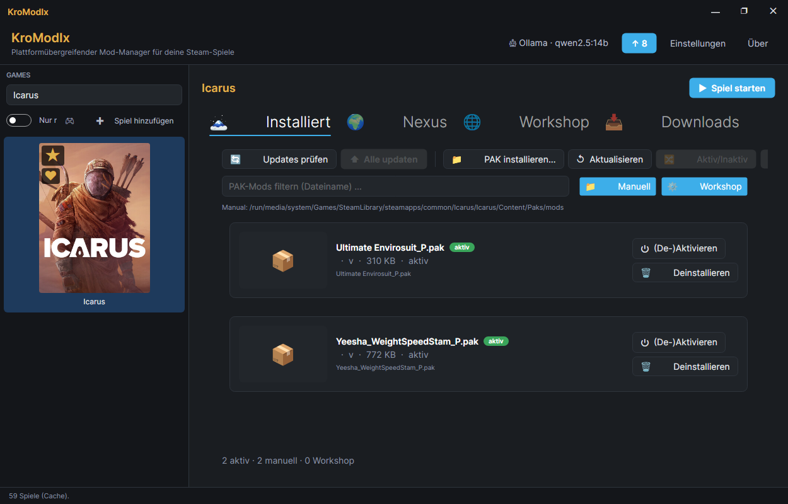

# KroModIx.Plugin.Icarus

**Icarus** (RocketWerkz) Mod-Manager als Plugin für den
[KroModIx](https://github.com/KroModIx/KroModIx). **Alle vier Icarus-Mod-Arten
in einer Ansicht:** PAK-Mods, Steam-Workshop-Abos, UE4SS-Lua-Mods und
Datentabellen-Mods (`.EXMODZ`). Mod-Archive (ZIP/RAR/7z) werden ausgepackt und
einsortiert, Nexus-Katalog mit Direct-Download (Premium) oder Browser-Weg
(Free), Update-Discovery für installierte Mods, KI-Zusammenfassung im
Detail-Dialog.

## Voraussetzungen

Braucht den [KroModIx-Host](https://github.com/KroModIx/KroModIx) **ab
v1.27.0** — dort sitzen der Backup-Baukasten und der gemeinsame
Versions-Vergleich, gegen die dieses Plugin gebaut ist. Ältere Hosts laden
das Plugin nicht.

## Screenshot

## Ziel-Spiel

**Icarus** — Steam AppId 1149460.

- Manuelle PAK-Mods: `<Icarus-Install>/Icarus/Content/Paks/mods/`
- Steam-Workshop-Abos: `<Library>/steamapps/workshop/content/1149460/`
- UE4SS-Lua-Mods: `<Icarus-Install>/Icarus/Binaries/Win64/Mods/`
- Datentabellen-Mods: die `.EXMODZ` bleiben im Plugin-Datenordner, ins Spiel
  geht nur das daraus gebaute `zzz_KroModIx_Merged_P.pak`

## Neu in v1.24.0

**Datentabellen-Mods (`.EXMODZ`).** Die Pakete des Icarus Mod Managers
funktionieren jetzt — damit ist die vierte und letzte Mod-Art abgedeckt. So
eine Mod ist kein fertiges Pak, sondern eine Änderungsliste gegen die
Datentabellen des Spiels. Das Plugin rechnet daraus ein Pak, und zwar aus
**deiner** installierten Spielversion.

**Alle Datentabellen-Mods landen in einem gemeinsamen Pak.** Das ist nicht
Bequemlichkeit: eine Tabellen-Überschreibung ist immer die ganze Tabelle. Als
getrennte Paks würden sich zwei Mods, die dieselbe Tabelle anfassen,
gegenseitig komplett überschatten — eine von beiden wäre wirkungslos. Im
gemeinsamen Pak greifen sie auf Feldebene ineinander, und nur wenn zwei Mods
wirklich dasselbe Feld derselben Zeile setzen, gewinnt die untere in der
Liste.

**Nach einem Icarus-Update musst du neu bauen** — und das Plugin sagt es dir.
Das gebaute Pak steht auf den Basistabellen der Spielwoche, gegen die es
gerechnet wurde. Aktualisiert Icarus diese Tabellen, würde das alte Pak deren
neue Werte zurückdrehen. Der Installiert-Tab erkennt das und schaltet den
Knopf „🔨 Neu bauen" auf Akzent.

## Neu in v1.23.0

**Mod-Archive.** Bisher nahm das Plugin nur nackte `.pak`-Dateien an. Nexus
liefert Icarus-Mods aber als ZIP, RAR oder 7z — oft mit mehreren Teilen in
einem Paket. Diese Archive werden jetzt ausgepackt und einsortiert.

**UE4SS-Lua-Mods.** Der Lua-Mod-Loader lässt sich aus dem Plugin heraus
installieren, Lua-Mods stehen in derselben Liste wie die PAKs und lassen sich
dort ein- und ausschalten.

**Unter Linux: die DLL-Umleitung.** UE4SS hängt sich über eine eigene
`dwmapi.dll` ein, Proton bevorzugt aber seine eigene — ohne Umleitung startet
der Loader nicht, und zwar ohne jede Fehlermeldung. Der Installiert-Tab sagt,
wenn das der Fall ist, und setzt die Umleitung auf einen Klick.

## Features

### Installiert-Tab
- Manuelle PAKs, Steam-Workshop-Abos, **UE4SS-Lua-Mods und
  Datentabellen-Mods** gemeinsam gelistet, jede Quelle mit eigenem Badge
  (Workshop-Rows sind read-only, Steam verwaltet sie)
- **Datentabellen-Karte** oben: wie viele Mods aktiv sind, wann das
  gemeinsame Pak gebaut wurde, und ob es noch zum Spielstand passt
- **UE4SS-Karte** oben: sagt, ob der Loader installiert ist, ob die
  DLL-Umleitung steht und wann der Loader zuletzt wirklich geladen wurde
  (das verrät nur seine `UE4SS.log` — installierte Dateien allein beweisen
  es nicht). Dazu „⬇ UE4SS installieren" und „🔧 DLL-Umleitung setzen".
- Cover-Enrichment via Nexus für Manual-PAKs mit erkennbarer Nexus-Mod-Id
  im Filename
- **🔄 Updates prüfen** — vergleicht installierte Version (aus Filename)
  mit `nexus/mods/{id}.json.version`
- **⬆ Alle updaten** — Bulk-Update aller Manual-PAKs sequenziell
  (Nexus-Rate-Limit-Rücksicht)
- **🔍 Details** per Doppelklick oder Button
- **Multi-Select** mit Bulk-Aktivieren/Deaktivieren/Deinstallieren
- Filter (Suche + Manual/Workshop/Lua/Tabellen-Toggles), F5/Ctrl+F/Del-Shortcuts,
  Drag&Drop von `.pak`-, `.zip`-, `.rar`- und `.7z`-Dateien
- Backup + Restore mit Enabled-State-Manifest

### Nexus-Tab (Katalog)
- Aggregation aus `latest_added` + `latest_updated` + `trending` + extended
  via `updated.json?period=1m` (Auto-Trigger bei < 100 Basis-Einträgen)
- Cover, Autor, Version, Endorsements, Summary
- Doppelklick öffnet Detail-Dialog mit voller Beschreibung + KI
- **⬇ Download** für Premium-User (Direct-URL)
- Free-User: „↗ Nexus öffnen" → Browser mit Slow-Wall

### Downloads-Tab
- Alle heruntergeladenen Mod-Dateien (`.pak`, `.zip`, `.rar`, `.7z`) mit
  Nexus-Enrichment (Cover, Autor, Version, Summary — via `mod_id` aus dem
  Dateinamen)
- Bei Archiven steht in der Row, was drin ist („1 PAK · 1 Lua-Mod"), bevor
  du installierst
- **📥 Alle installieren** — Bulk-Install
- Pro Row: Installieren + 🔍 Details + Löschen
- Auto-Refresh via FileSystemWatcher

### Nexus-Einstellungen
- Personal-API-Key eintragen (verschlüsselt via DPAPI/AES gespeichert,
  niemals im Log)
- Verify-Button (setzt Premium-Flag), Game-Slug, Cache-Refresh-Intervall

### IUpdateNotifier
Grüner ↑-Badge auf der Icarus-Kachel **nur bei echten Updates für
installierte Manual-PAKs** (v1.15.1). Neue Katalog-Einträge sind ein
Community-News-Signal und werden bewusst nicht mehr im Actionable-Badge
summiert — sonst wäre der Pfeil dauerhaft grün und der User verliert
Vertrauen ins Signal.

## Nexus-API-Key beschaffen

1. Bei [nexusmods.com](https://www.nexusmods.com) anmelden (kostenlos)
2. [Account → API Access](https://www.nexusmods.com/users/myaccount?tab=api%20access)
   öffnen
3. „Personal API Key" generieren, kopieren
4. Im Plugin-Tab „Nexus-Einstellungen" einfügen, „Speichern", „Verify" klicken

**Rate-Limit:** 250 Requests/h für Free-User, 2500/h für Premium.
Der Key liegt lokal DPAPI/AES-verschlüsselt und wird nie geloggt.

**Direct-Download** (`⬇ Download` in Katalog + `⬆ Alle updaten` im
Installiert-Tab) funktioniert nur mit **Nexus-Premium** — Nexus liefert
Direct-URLs nur für zahlende User. Free-User klicken „↗ Nexus öffnen",
laden im Browser via Slow-Wall, das Plugin picks die Datei aus dem
Downloads-Ordner auf.

## Installation

Aus [Release](https://github.com/KroModIx/KroModIx.Plugin.Icarus/releases)
das ZIP entpacken nach:

- **Linux:** `~/.config/KroModIx/plugins/kroste.icarus/`
- **Windows:** `%APPDATA%\KroModIx\plugins\kroste.icarus\`

Alternativ: 1-Klick-Install über die Install-Karte in der KroModIx-Sidebar.

## Backups vor jedem Install

Bevor das Plugin Dateien ins Spiel schreibt, legt es einen Snapshot des
Ziel-Verzeichnisses an — bei Einzel-Installs einen pro Mod, bei Bulk-Installs
**einen** vor dem ganzen Durchlauf. Zurückspielen läuft über das
Backups-Fenster im Kontextmenü der Sidebar-Kachel; es gibt bewusst kein
Auto-Rollback, damit du entscheidest, welchen Stand du zurückholst.
Aufbewahrt werden die letzten zehn Snapshots pro Spiel.

Schlägt ein Snapshot fehl, läuft der Install trotzdem durch (mit Log-Eintrag)
— das Backup ist ein Netz, kein Türsteher.

## Datentabellen-Mods (.EXMODZ)

Viele Icarus-Mods ändern keine Dateien, sondern **Werte**: Rezepte,
Item-Eigenschaften, Erfahrungskurven. Solche Mods kommen als `.EXMODZ` — eine
Änderungsliste, kein fertiges Pak. Das Plugin rechnet daraus ein Pak gegen
deine installierte Spielversion.

**So läuft es:** du installierst das Archiv wie jede andere Mod. Die `.EXMODZ`
wandert in den Plugin-Datenordner, und das Plugin baut daraus (zusammen mit
allen anderen aktiven Datentabellen-Mods) ein einzelnes
`zzz_KroModIx_Merged_P.pak` im Mods-Ordner des Spiels.

**Nach jedem Icarus-Update neu bauen.** Das Spiel liefert wöchentlich neue
Datentabellen aus. Das gebaute Pak steht aber auf dem Stand, gegen den es
gerechnet wurde — es würde die neuen Werte zurückdrehen. Die
Datentabellen-Karte im Installiert-Tab erkennt das und sagt „Icarus wurde
aktualisiert". Ein Klick auf **🔨 Neu bauen** genügt; die `.EXMODZ` liegen
noch da, es muss nichts neu heruntergeladen werden.

**Wenn eine Mod nicht zur Spielwoche passt**, nennt das Plugin sie und baut
die anderen trotzdem. Eine einzige veraltete Mod nimmt also nicht alle
anderen mit.

**Ein Hinweis, falls du schon ein anderes Werkzeug benutzt:** liegt ein
`zzz_LMM_Merged_P.pak` im Mods-Ordner, wird es nach Alphabet nach unserem
eingehängt und überstimmt es bei gemeinsamen Tabellen. Das Plugin sagt es,
fasst die fremde Datei aber nicht an — eines von beiden sollte weg.

## UE4SS einrichten (Lua-Mods)

Manche Icarus-Mods bestehen aus einem Lua-Skript und brauchen dafür
**UE4SS**, den Lua-Mod-Loader für Unreal-Engine-Spiele. Der Installiert-Tab
führt dich durch:

1. **„⬇ UE4SS installieren"** — lädt die neueste stabile Ausgabe von
   [UE4SS-RE/RE-UE4SS](https://github.com/UE4SS-RE/RE-UE4SS) und entpackt sie
   nach `Icarus/Binaries/Win64/`. Derselbe Knopf ist später der Update-Weg;
   deine `UE4SS-settings.ini` und `Mods/mods.txt` bleiben dabei stehen.
2. **„🔧 DLL-Umleitung setzen"** (nur Linux) — erscheint, wenn die Umleitung
   fehlt. Ein Klick trägt sie in die `user.reg` des Proton-Präfix ein, sie
   wirkt beim nächsten Spielstart.
3. **Spiel starten.** Danach steht in der UE4SS-Karte, wann der Loader
   zuletzt geladen wurde. Bleibt dort „Noch keine UE4SS.log", ist er nicht
   eingehängt worden.

**Warum Schritt 2 nötig ist:** Proton bringt seine eigene `dwmapi.dll` mit
und bevorzugt sie gegenüber der von UE4SS. Ohne Umleitung passiert
schlicht nichts — das Spiel startet normal, es gibt keine Fehlermeldung, und
die Lua-Mods tun einfach nicht, was sie sollen.

**Eine Grenze, die du kennen solltest:** legt Proton das Präfix neu an
(Proton-Wechsel, Reset über „Spieldateien überprüfen"), ist die Umleitung
weg. Das Plugin prüft sie bei jedem Aktualisieren neu und meldet sich
wieder — es merkt sich den Zustand bewusst nicht.

Nur der **Host** einer Welt braucht Lua-Mods; in der Welt eines Freundes
muss er sie installiert haben, nicht du.

## Lizenz

MIT — siehe [LICENSE](LICENSE).

---

☕ [buymeacoffee.com/kroste](https://buymeacoffee.com/kroste)
